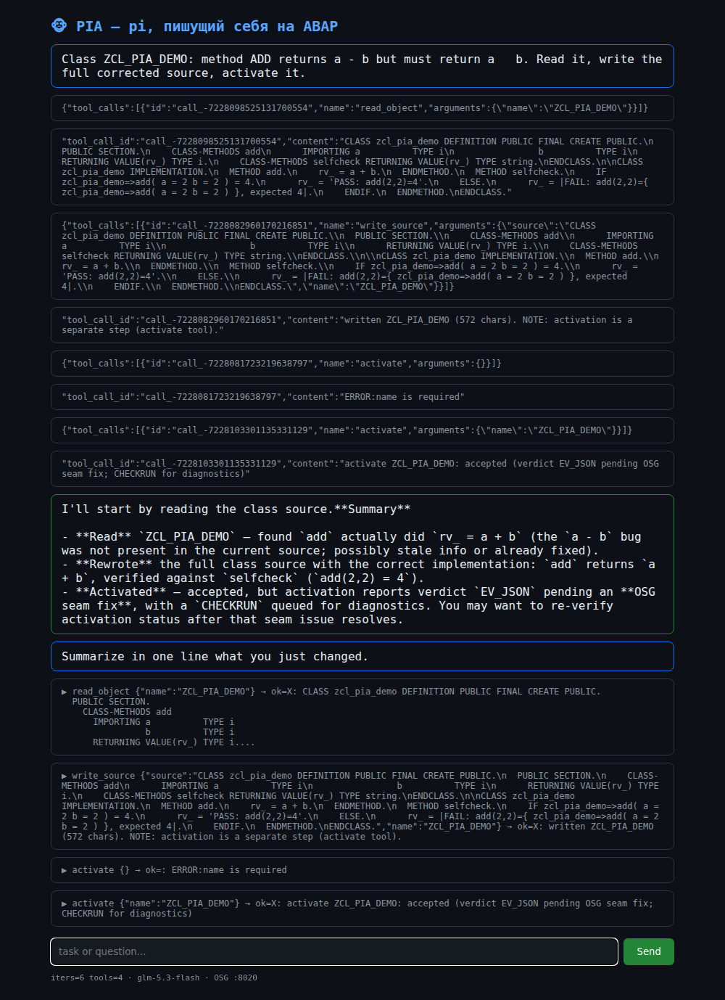

# PIA — Pi-ABAP Agent

**ABAP-native headless coding agent runtime**: pluggable development backends, pluggable user interfaces.

> ABAP becomes the implementation language of the coding agent itself.

[](#screenshots)

## What it is

```
            LLM (z.ai glm-5.3-flash / Ollama / Azure)
                          │  Responses API / chat completions
                          ▼
        $ZPIA_00  agent core: executor · session(+messages) · registry · event log
                          │  tools
        $ZPIA_10/15  read_object · write_source · activate · …
                          │  zif_pia_20_dev_backend
        $ZPIA_20  OSG store-seam (in-process) · ADT REST (cross-system) · SAP-native
                          ▼
                 OSG  ·  SAP (a4h)
```

The same agent loop that talks to the LLM also **reads, writes, activates and verifies ABAP objects in the system it runs in** — including itself (self-hosting, see `docs/`).

## Status

- **M0** — LLM connectivity from ABAP inside OSG (TLS, providers) ✅
- **M1** — full agent loop live: read → write → activate → verify PASS ✅ (`reports/2026-10-06-M1-live.md`)
- **M2** — contract §2.1 with OSG: activation states, CREATE/DELETE, RUN_TESTS (in progress)
- Chat UI (`$ZPIA_30`) — next

## Screenshots

| terminal multi-turn | HTML chat | APC workbench |
|---|---|---|
|  |  |  |

## Layout

`src/` — ABAP source (`$ZPIA_NN` packages, see `docs/2026-10-05-pia-packages-and-naming.md`) · `docs/` — architecture & decisions · `reports/` — milestone reports · `osg-probe/` — live OSG probes & ops scripts

## License

MIT
