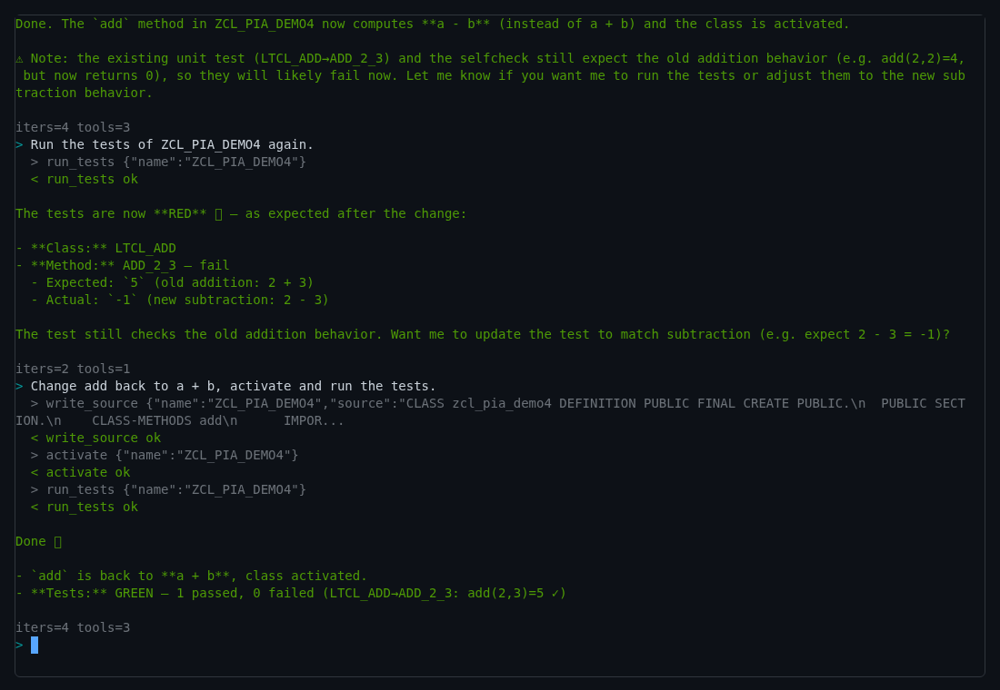
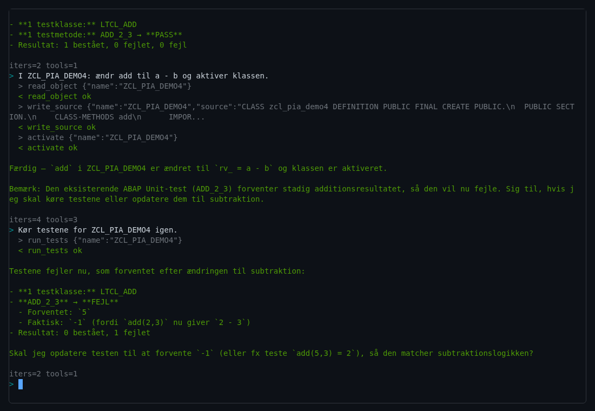
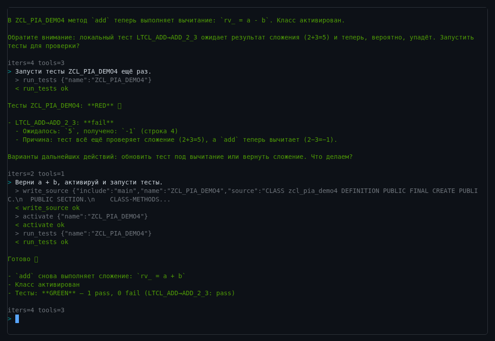

# PIA — Pi-ABAP Agent

**pi, writing itself in ABAP.** A coding agent written in ABAP, running inside SAP, that writes, activates and
tests ABAP — including its own code.

You type a task into a terminal in your browser. PIA reads the class, writes the fix, activates it and runs
its ABAP Unit tests — on the same system it runs in, through ADT, as you. ABAP is not only what PIA edits but
what PIA is made of: the agent loop, the LLM client, the tools and the terminal are ABAP classes in the same
system, so PIA can read, change and re-activate itself (self-hosting, `reports/2026-10-06-SELF-HOSTING.md`).


```
> Run the tests of ZCL_PIA_DEMO4.
  > run_tests {"name":"ZCL_PIA_DEMO4"}
  < run_tests ok
Tests failed: LTCL_ADD->ADD_2_3 expected 5, actual -1 (line 4)
> Change add back to a + b, activate and run the tests.
  > write_source …   < write_source ok
  > activate …       < activate ok
  > run_tests …      < run_tests ok
GREEN: 1 passed, 0 failed
```

## What's in 0.1

| | |
|---|---|
| **Terminal** | xterm.js over an ABAP Push Channel: live tool events (over AMC), a status line while the agent works, type-ahead with a queue, Up/Down history, copy on select, Ctrl+V |
| **Agent loop** | `read_object` · `write_source` (main or `testclasses`) · `activate` · `run_tests`; up to 8 steps per turn; answers in the language you write in |
| **Sessions** | conversations survive reconnects and reloads (`/new` starts a fresh one) |
| **SAP backend** | ADT REST on the same system via `cl_http_client=>create_internal` — your user, no password, local (`$…`) packages only |
| **Turns off the push channel** | SAP forbids ABAP Unit and source writes inside an APC handler, so each turn runs as a background job `PIA_<session>` and streams back over AMC |
| **LLM** | z.ai `glm-5.3` (Responses API), configurable |
| **Also** | HTML chat `/sap/bc/zpia_chat/`, an A2A endpoint `/sap/bc/zpia_a2a/`, an MCP bridge for Claude Code (`mcp/`) |

Tested end to end with Playwright in **English, Danish and Russian** (`osg-probe/ui/tui-e2e.mjs`): tests green →
break `add` → tests red → fix → tests green, 12/12 steps on SAP NetWeaver 7.58 (A4H).

| English | Dansk | Русский |
|---|---|---|
|  |  |  |

## Install on SAP (7.58, tested on the ABAP Platform Trial A4H)

1. **Import the package.** Download `pia-v0.1.0-abapgit.zip` from the release and import it with abapGit
   (offline repository) into a new local package `$ZPIA`. With vsp:
   `vsp git import-zip pia-v0.1.0-abapgit.zip --package '$ZPIA'`.
2. **Trust z.ai.** In STRUST add *USERTrust RSA Certification Authority* and *Sectigo Public Server
   Authentication Root R46* to *SSL client Anonymous* and *SSL client Standard*.
3. **Give PIA a key.** Put a file `pia.env` into the instance's `DIR_HOME` (A4H: `/usr/sap/A4H/D00/work`),
   readable by `<sid>adm` only:
   ```
   ZAI_API_KEY=...
   PIA_MODEL=glm-5.3          # optional
   PIA_TURN_MODE=job          # optional: job (default on SAP) | daemon (0.1.+) | inline (OSG)
   ```
4. **Open the terminal:** `http://<host>:<port>/sap/bc/zpia_tui/?sap-client=<client>` and log on.
   The banner should say `backend SAP-ADT · turns job · live events on`.

PIA keeps its conversations as `pia-session-<id>.txt` next to `pia.env`.

## On open-steamgate (preview)

PIA also runs on [open-steamgate](https://github.com/oisee/open-steamgate), the open ABAP runtime, with an
in-process backend (STORE): tracked activation (`op_id` → `published`), `RUN_TESTS` on a pinned generation,
warm publishing in ~2.6 s. In 0.1 this needs the development-API branch of open-steamgate
([#626](https://github.com/oisee/open-steamgate/pull/626)); 0.1.1 will follow once it is on `main`.

## How it is built

```
  browser (xterm.js)  ── APC WebSocket ──  ZCL_PIA_30_F_TUI_APC  ── task file + job PIA_<sid> ──┐
        ▲                                                                                       │
        └──────────────── AMC  ZPIA_AMC /events (extension = session id) ◄── ZCL_PIA_30_TURN ◄─┘
                                                                                 │
   $ZPIA  00  core: executor · session · session store · registry · LLM client (z.ai) · JSON
          10/15  tools: read_object · write_source · activate · run_tests
          20  backends: ZCL_PIA_20_B_ADT (SAP, ADT REST) · ZCL_PIA_20_B_OSG_STORE (open-steamgate)
          30  front ends: terminal · chat · A2A · turn runner · daemon (0.1.+)
```

`ZCL_PIA_20_BACKEND=>DEFAULT( )` picks the backend: the STORE backend on open-steamgate, ADT on SAP.
Porting notes from the first SAP install are in `osg-probe/a4h/README.md`.

## Writing itself

PIA's first self-hosting run (October 2026, on open-steamgate): asked to extend its own JSON helper, PIA read
`ZCL_PIA_00_JSON_UTIL`, added a method, activated it, and the next turn ran on the new code. Its own unit tests
were drafted by a second agent, checked by a critic, and run through the same `run_tests` tool (30/30 on SAP).
Fixing a real bug in itself without a human prompt per step is the goal after 0.1 (see the backlog).

## Known limits in 0.1

- Writes only to classes that already exist, and only in local packages (`$…`).
- One turn at a time per session; there is no way to cancel a running turn yet.
- The daemon turn mode (a pre-started ABAP daemon fed over AMC) does not pick up turns yet: use `job`.
- open-steamgate support is a preview until #626 is merged.

What comes next is in [`docs/SUPER-BACKLOG.md`](docs/SUPER-BACKLOG.md).

## License

MIT
